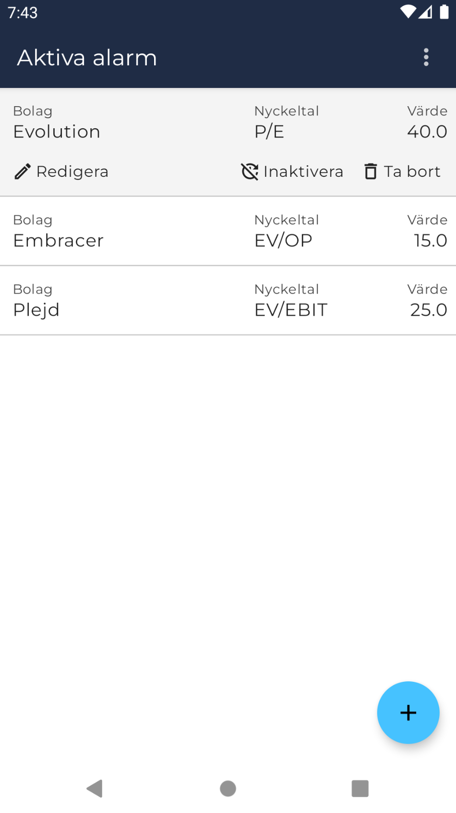
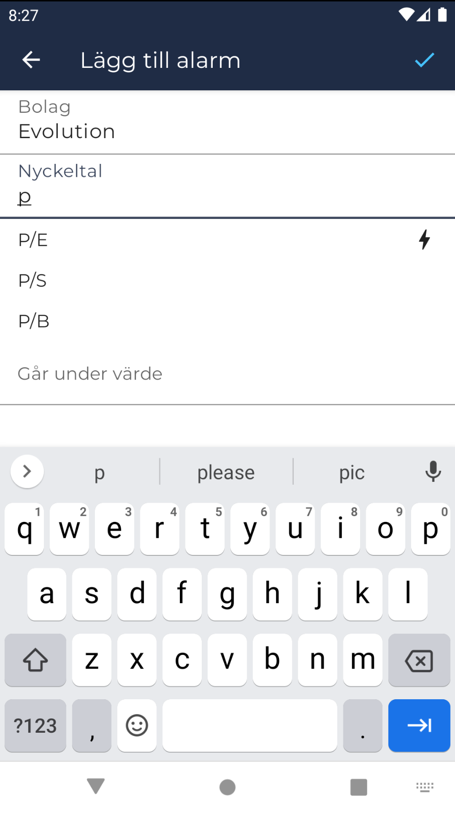

# Börsdata Valuation Alarmer

**Only working Android implementation for now**. See [TODO](#todo).

## Screenshots

 
  
  

[See more](screenshots)

## About
  * Uses Börsdata API.
  * Requires personal API key from Pro membership.
  * No separate backend, and key is only stored, encrypted, on local device.

### Data Updates and Alarm Triggers
  * BD only provides API data for nordic companies unfortunately.
  * BD data is only updated once per day at 21:00 CET.
  * Schedule for alarm triggers will run on the hour, every hour, during market open (swedish time).
    * Some KPIs are calculated on the fly, others will only change once per day. Live KPIs will be calculated on each trigger, the rest will run once per day. Current "Live KPIs" (marked by lightning bolt when selecting in GUI):
      * `P/E`
      * `EV/E` 
      * `EV/EBIT`
      * `EV/EBITDA` 
      * `EV/FCF` 
      * `EV/OP`
      * `EV/S`

## Tech
  * KMM project.
    * Ktor
    * Sql Delight
    * Koin
    * KVault
    * Multiplatform Settings
  * Android
    * Jetpack Compose
    * StateFlow
    * Coroutines 
    * WorkManager
    * Firebase Messaging
  * iOS
    * SwiftUI
  * Firebase Cloud Messaging (FCM)
    * Cloud Function serves as "ping" to execute workers on mobile devices. No data is stored in any backend. 
  
## Setup 
### Dev
  1. https://kotlinlang.org/docs/multiplatform-mobile-setup.html (listen to `kdoctor`)
  2. (Only for M1 Mac) https://youtrack.jetbrains.com/issue/KT-49418/KMM-Wizard-Android-Studio-BumbleBee-202111-Beta1-Gradle-Build-Failed-As-Soon-As-Completes-Wizard-Due-To-pod-install-Task-Failed#focus=Comments-27-5429773.0-0 
  3. (Only Mac) Fix Java for Xcode if you installed java through third party jdk manager.
     1. `sudp mkdir -p /Library/Java/JavaVirtualMachines/<jdk_name>/Contents`
     2. `sudo ln -s /path/to/jdk /Library/Java/JavaVirtualMachines/<jdk_name>/Contents/Home`
     3. Find example `Info.plist` and add in `Contents`. Update values.
  4. Get `google-services.json` and add to `androidApp` dir.
  5. Update java.home in gradle.properties

### Release
Get/Generate `.jks` keystore and create `keystore.properties` in project root dir.

## TODO 
### iOS
  * GUI
    * Add
      * Clear suggestions after navigating back to list view
      * Autofocus first field
      * Show suggestions again if new input is entered
      * Color highlighting on focused field
      * Keyboard navigation / actions
    * Edit
  * Firebase messaging
  * BG Worker for jobs

