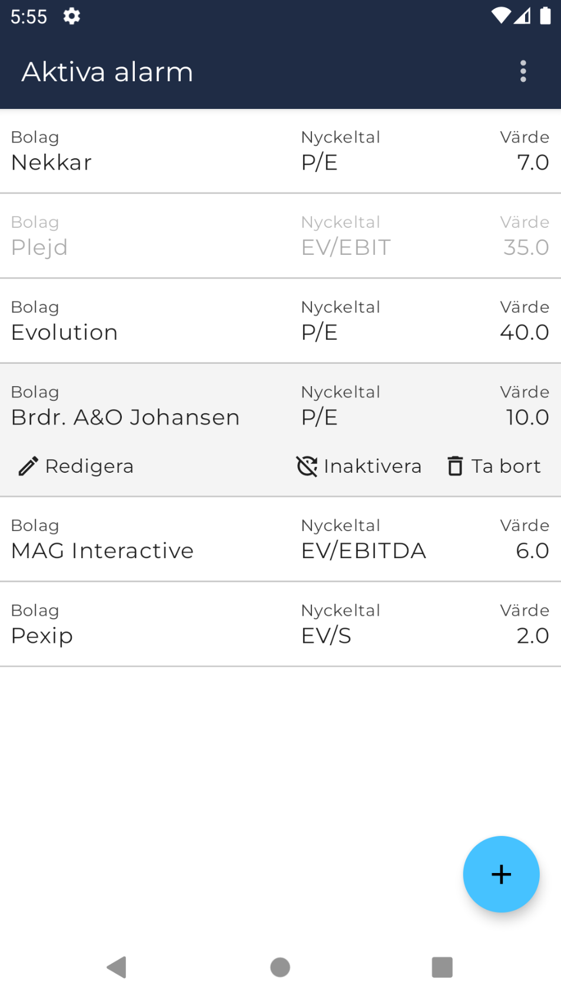

# Börsdata Valuation Alarmer

**Only working Android implementation for now**. See [TODO](#todo).

## Screenshots

 
  
  

[See more](screenshots)

## About
  * Uses Börsdata API.
  * Requires personal API key from Pro membership.
  * No separate backend, and key is only stored, encrypted, on local device.

### Data Updates and Alarm Triggers
  * BD only provides API data for nordic companies unfortunately.
  * BD data is only updated once per day at 21:00 CET.
  * Schedule for alarm triggers will run on the hour, every hour, during market open (swedish time).
    * Some KPIs are calculated on the fly, others will only change once per day. Live KPIs will be calculated on each trigger, the rest will run once per day. Current "Live KPIs" (marked by lightning bolt when selecting in GUI):
      * `P/E`
      * `EV/E` 
      * `EV/EBIT`
      * `EV/EBITDA` 
      * `EV/FCF` 
      * `EV/OP`
      * `EV/S`

## Tech
  * KMM project.
    * Ktor
    * Sql Delight
    * Koin
    * KVault
    * Multiplatform Settings
  * Android
    * Jetpack Compose
    * StateFlow
    * Coroutines 
    * WorkManager
    * Firebase Messaging
  * iOS
    * TODO
  * Firebase Cloud Messaging (FCM)
    * Cloud Function serves as "ping" to execute workers on mobile devices. No data is stored in any backend. 
  
## TODO 
**iOS**
  * Complete GUI implementation.
  * A physical device is needed to PoC BackgroundTasks, which the author does not possess.

